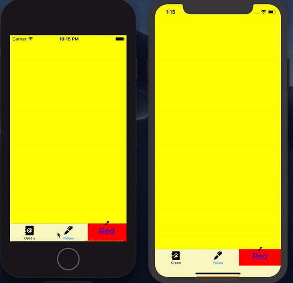

## Официальная документация

[Здесь](https://github.com/Ramotion/animated-tab-bar) можно ознакомится с официальной 
документацией по данной библиотеке

##Классы

### RAMAnimatedTabBarController

Можно использовать класс **RAMAnimatedTabBarController**, либо унаследоваться от него.  
В качестве контроллеров для таббара можно использовать любые контроллеры, главное чтобы для каждого был установлен **tabBarItem** наследующийся от **RAMAnimatedTabBarItem**, иначе вылетит *assertionFailure*.  
     
Есть **bottomLine**, которая по умолчанию скрыта, так же можно поменять цвет и время анимации. К сожалению высота всегда одинакова и равна 2, однако я создал [пулл](https://github.com/Ramotion/animated-tab-bar/pull/254) с функционалом для ее изменения.
  
```swift
var isBottomLineShow: Bool = false
var bottomLineColor: UIColor = .black
var bottomLineMoveDuration: TimeInterval = 0.3
```

### RAMAnimatedTabBarItem

Опять же, можно использовать **RAMAnimatedTabBarItem**, либо унаследоваться от него.   
Из интересных свойств есть: 
   
```swift 
var iconView: (icon: UIImageView, textLabel: UILabel)?
var animation: RAMItemAnimation!
```

*IconView* это собственно из чего состоит item: иконка и текст.  
*Animation* это анимация, которая будет воспроизводится при select/deselect ивентах. Она обязательно должна быть заданна.  
Также есть несколько свойств для настройки отображения, типо цвета или шрифта.  
Есть еще *badge*, который по сути является сабклассом лейбла. Появляется когда задать ему *badgeValue != nil*

### RAMItemAnimation

Класс для анимации для TabBarItem.   
Есть несколько встроенных анимаций, которые можно засабкласить или исопльзовать как есть, их можно найти на странице библиотеки.   
Можно создать свою анимацю если засабкласить **RAMItemAnimation**. Нужно будет переопределить несколько простых методов "жизненного цикла" select/deselect item animation. И собственно написать саму анимацию для imageView и textLabel, которые приходят в качетве параметров.

##Demo

